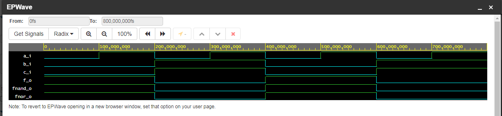
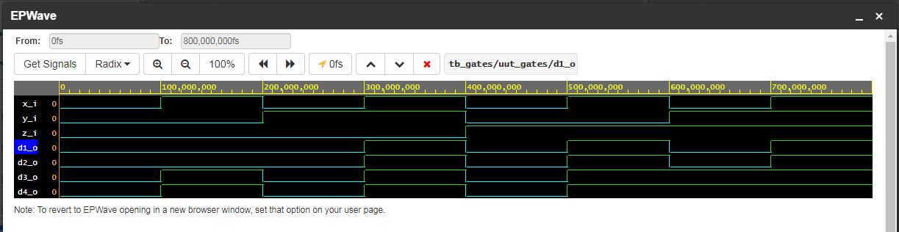

# 01 - Logic gates

## Lab assignment

- [x] 1. Submit the GitHub link to your Digital-electronics-1 repository.

- [x] 2. Verification of De Morgan's laws of function f(c,b,a). Submit:

* Listing of VHDL code design.vhd,
* Screenshot with simulated time waveforms,
* Link to your public EDA Playground example.

- [x] 3. Verification of Distributive laws. Submit:

* Listing of VHDL code design.vhd,
* Screenshot with simulated time waveforms,
* Link to your public EDA Playground example.

> - [ ] Prepare all tasks in your README file Digital-electronics-1/Labs/01-gates/README.md, export/print it to PDF, use BUT e-learning web page and submit a single PDF file. The deadline for submitting the task is the day before the next laboratory exercise.


## 1 Submitting GitHub repository

My GitHub [repository](https://github.com/Nemecxpetr/Digital-electronics-1).

## 2 Verification of De Morgan's laws of function f(c,b,a)
Parts:
* Listing of VHDL code `design.vhd`,
* Screenshot with simulated time waveforms,
* Link to your public EDA Playground example.
 
  Function is defined as follows. We also derived the only NAND and NOR form of function via De Morgan's laws.


> Equations were generated by [Online LaTeX Equation Editor](https://www.codecogs.com/latex/eqneditor.php).

  Code from [EDU Playground](https://www.edaplayground.com/x/DcV5):

> Excerpt from `design.vhd`:
```vhdl
architecture dataflow of gates is
begin
    f_o  <= (not b_i and a_i) or (not b_i and not c_i);
    fnand_o <= not(not((not b_i) and a_i) and not(not c_i and not b_i));
    fnor_o <= not(b_i or not a_i) or not(c_i or b_i);

end architecture dataflow;
```
  Here are the simulation results in table:

| **c** | **b** |**a** | **f(c,b,a)** | **f(c,b,a)nand** | **f(c,b,a)nor** |
| :-: | :-: | :-: | :-: | :-: | :-: |
|  0  |  0  |  0  |  1  |  1  |  1  | 
|  0  |  0  |  1  |  1  |  1  |  1  |   
|  0  |  1  |  0  |  0  |  0  |  0  |    
|  0  |  1  |  1  |  0  |  0  |  0  |     
|  1  |  0  |  0  |  0  |  0  |  0  |   
|  1  |  0  |  1  |  1  |  1  |  1  |   
|  1  |  1  |  0  |  0  |  0  |  0  |    
|  1  |  1  |  1  |  0  |  0  |  0  |   

  And a photo of simulation results in EDA Playground: 


  We succesfully verified De Morgan's laws with function f(c,b,a).

## 3 Verification of Distributive laws

Parts:
* Listing of VHDL code `design.vhd`,
* Screenshot with simulated time waveforms,
* Link to your public EDA Playground example.

**Distributive laws**


    
Code from [EDU Playground](https://www.edaplayground.com/x/8Nx3)

> Excerpt from `design.vhd`:
  
```vhdl
architecture dataflow of gates is
begin
    d1_o  <= (x_i and y_i) or (x_i and z_i);
    d2_o  <= x_i and (y_i or z_i);
    d3_o  <= (x_i or y_i) and (x_i or z_i);
    d4_o  <= x_i or (y_i and z_i);
   
end architecture dataflow;
```
Photo of the simulation results in EDA Playground: 


From the simulation it is apparent that _d1_ and _d2_ are equal as well as _d3_ and _d4_ which **verifies distributive laws**.


