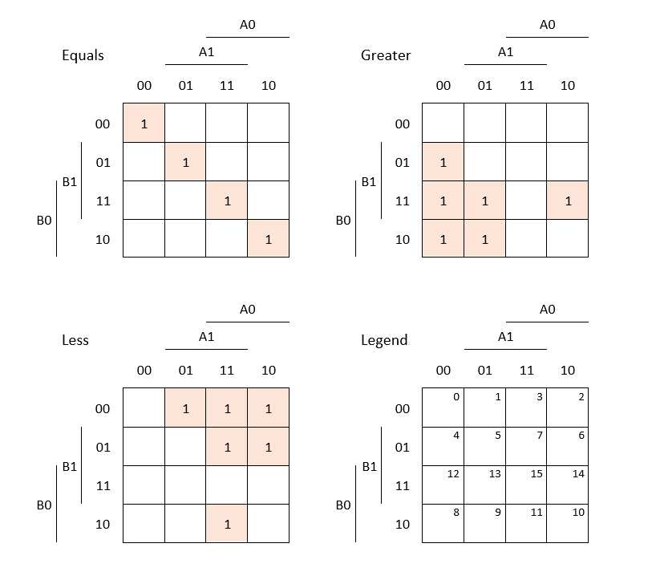
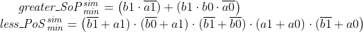

# 02 Logic

## Lab assignment

1. Preparation tasks (done before the lab at home). Submit:
  * -[x] Binary comparator truth table.

2. A 2-bit comparator. Submit:
  * -[x] Karnaugh maps for all three functions.
  * -[x] Simplified SoP form of the "greater than" function 
  * -[x] And simplified PoS form of the "less than" function.


3. A 4-bit binary comparator. Submit:
  * -[x] Listing of VHDL code (`design.vhd`),
  * -[x] Listing of VHDL testbench (`testbench.vhd`),
  * -[x] Listing of simulator console output, i.e. with reported error,
  * -[x] Link to your public EDA Playground example.

## 1 Binary coparator truth table

| **Dec. equivalent** | **B[1:0]** | **A[1:0]** | **B is greater than A** | **B equals A** | **B is less than A** |
| :-: | :-: | :-: | :-: | :-: | :-: |
| 0  | 0 0 | 0 0 | 0 | 1 | 0 |
| 1  | 0 0 | 0 1 | 0 | 0 | 1 |
| 2  | 0 0 | 1 0 | 0 | 0 | 1 |
| 3  | 0 0 | 1 1 | 0 | 0 | 1 |
| 4  | 0 1 | 0 0 | 1 | 0 | 0 |
| 5  | 0 1 | 0 1 | 0 | 1 | 0 |
| 6  | 0 1 | 1 0 | 0 | 0 | 1 |
| 7  | 0 1 | 1 1 | 0 | 0 | 1 |
| 8  | 1 0 | 0 0 | 1 | 0 | 0 |
| 9  | 1 0 | 0 1 | 1 | 0 | 0 |
| 10 | 1 0 | 1 0 | 0 | 1 | 0 |
| 11 | 1 0 | 1 1 | 0 | 0 | 1 |
| 12 | 1 1 | 0 0 | 1 | 0 | 0 |
| 13 | 1 1 | 0 1 | 1 | 0 | 0 |
| 14 | 1 1 | 1 0 | 1 | 0 | 0 |
| 15 | 1 1 | 1 1 | 0 | 1 | 0 |

According to the truth table, write canonical SoP (Sum of Products) and PoS (Product of Sums) forms for "equals" and "less than" functions:


## 2 A 2-bit binary comparator
Karnaugh maps for all free functions



Simplified SoP form of the "greater than" function and a PoS form of the "less than" function:



## 3 A 4-bit binary comparator

Public EDA Playground [link](https://www.edaplayground.com/x/Xmx8).

Listing of `design.vhd`


```vhdl
------------------------------------------------------------------------
-- Entity declaration for 4-bit binary comparator
------------------------------------------------------------------------
entity comparator_4bit is
    port(
        a_i            : in  std_logic_vector(4 - 1 downto 0);
        b_i			   : in  std_logic_vector(4 - 1 downto 0);

        B_less_A_o     : out std_logic;       -- B is less than A
        B_equals_A_o   : out std_logic;       -- B is equal to A
        B_greater_A_o  : out std_logic        -- B is greater than A
    );
end entity comparator_4bit;

------------------------------------------------------------------------
-- Architecture body for 4-bit binary comparator
------------------------------------------------------------------------

architecture Behavioral of comparator_4bit is
begin

    B_less_A_o    <= '1' when (b_i < a_i) else '0';
    B_equals_A_o  <= '1' when (b_i = a_i) else '0';
    B_greater_A_o <= '1' when (b_i > a_i) else '0';
    
end architecture Behavioral; 

```


Listing of `testebench.vhd`
```vhdl
------------------------------------------------------------------------
-- Architecture body for testbench
------------------------------------------------------------------------
architecture testbench of tb_comparator_4bit is

    -- Local signals
    signal s_a           : std_logic_vector(4 - 1 downto 0);
    signal s_b           : std_logic_vector(4 - 1 downto 0);
    signal s_B_greater_A : std_logic;
    signal s_B_equals_A  : std_logic;
    signal s_B_less_A    : std_logic;

begin
    -- Connecting testbench signals with comparator_2bit entity (Unit Under Test)
    uut_comparator_4bit : entity work.comparator_4bit
        port map(
            a_i           => s_a,
            b_i           => s_b,
            B_greater_A_o => s_B_greater_A,
            B_equals_A_o  => s_B_equals_A,
            B_less_A_o    => s_B_less_A
        );

    --------------------------------------------------------------------
    -- Data generation process
    --------------------------------------------------------------------
  p_stimulus : process
    begin
        -- Report a note at the begining of stimulus process
        report "Stimulus process started" severity note;


        -- First test values
        s_b <= "0000"; s_a <= "0000"; wait for 100 ns;
        -- Expected output
        assert ((s_B_greater_A = '0') and (s_B_equals_A = '1') and (s_B_less_A = '0'))
        -- If false, then report an error
        report "Test failed for input combination: 0000, 0000" severity error;
         
        s_b <= "0011"; s_a <= "0001"; wait for 100 ns;
        assert ((s_B_greater_A = '1') and (s_B_equals_A = '0') and (s_B_less_A = '0'))
        report "Test failed for input combination: 0011, 0001" severity error;
        
        s_b <= "0111"; s_a <= "0101"; wait for 100 ns;
        assert ((s_B_greater_A = '1') and (s_B_equals_A = '0') and (s_B_less_A = '0'))
        report "Test failed for input combination: 0111, 0101" severity error;
       
          s_b <= "1111"; s_a <= "1010"; wait for 100 ns;
        assert ((s_B_greater_A = '1') and (s_B_equals_A = '0') and (s_B_less_A = '0'))
        report "Test failed for input combination: 1111, 1010" severity error;
        
        s_b <= "0000"; s_a <= "1100"; wait for 100 ns;
        assert ((s_B_greater_A = '0') and (s_B_equals_A = '0') and (s_B_less_A = '1'))
        report "Test failed for input combination: 0000, 1100" severity error;
        
          s_b <= "0011"; s_a <= "1001"; wait for 100 ns;
        assert ((s_B_greater_A = '0') and (s_B_equals_A = '0') and (s_B_less_A = '1'))
        report "Test failed for input combination: 1011, 1001" severity error;
        
        s_b <= "0111"; s_a <= "1000"; wait for 100 ns;
        assert ((s_B_greater_A = '0') and (s_B_equals_A = '0') and (s_B_less_A = '1'))
        report "Test failed for input combination: 0111, 1000" severity error;
        
        s_b <= "0111"; s_a <= "0101"; wait for 100 ns;
        assert ((s_B_greater_A = '0') and (s_B_equals_A = '1') and (s_B_less_A = '0'))
        report "Test failed for input combination: 0111, 0101" severity error;
       
        report "Stimulus process finished" severity note;
        wait;
    end process p_stimulus;

end architecture testbench;


```

Listing of simulator console output, i.e. with reported error:

```
[2021-02-21 14:07:07 EST] ghdl -i design.vhd testbench.vhd  && ghdl -m  tb_comparator_4bit && ghdl -r  tb_comparator_4bit   
analyze design.vhd
analyze testbench.vhd
elaborate tb_comparator_4bit
testbench.vhd:46:9:@0ms:(report note): Stimulus process started
testbench.vhd:81:9:@800ns:(assertion error): Test failed for input combination: 0101, 0101
testbench.vhd:84:9:@800ns:(report note): Stimulus process finished
Done
```
