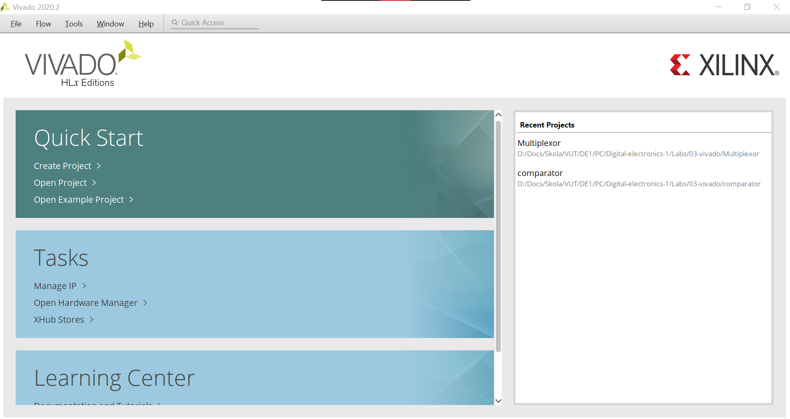
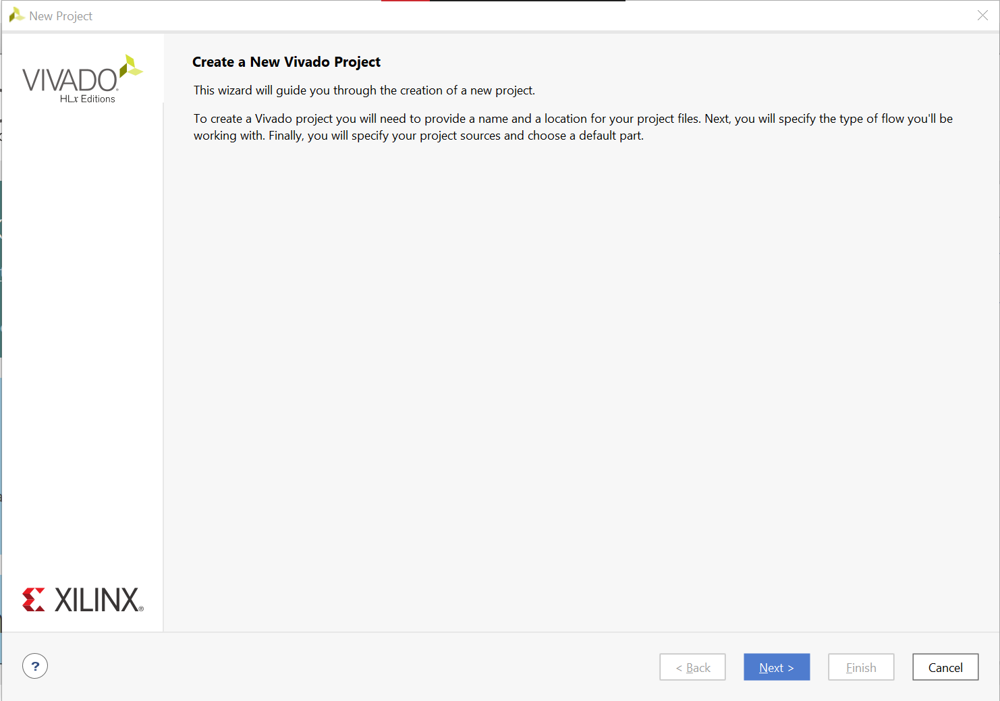
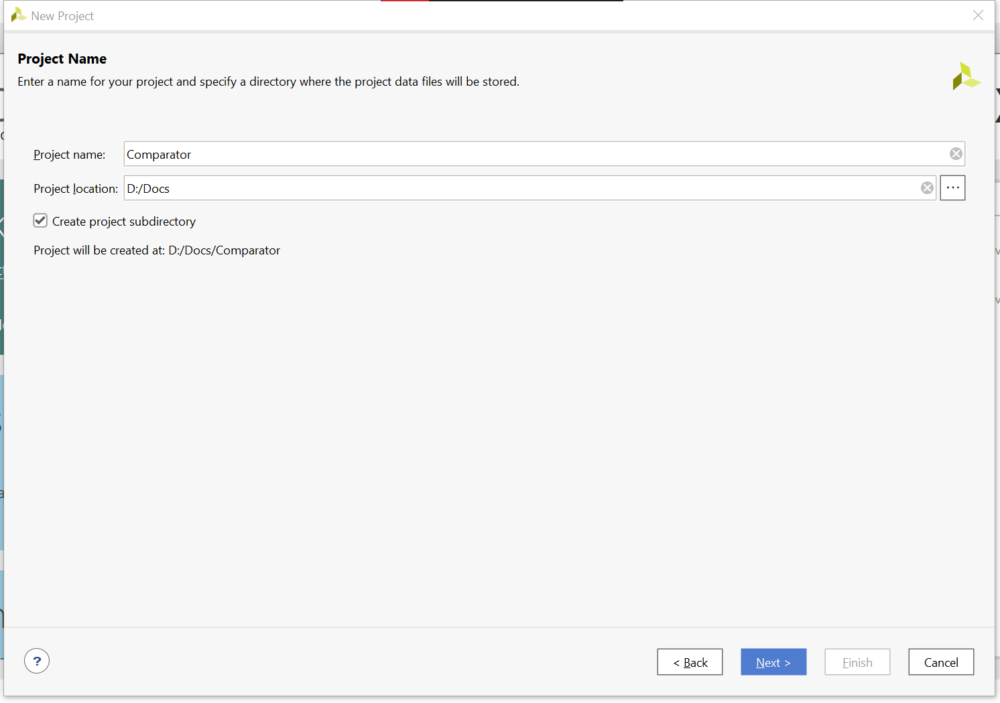
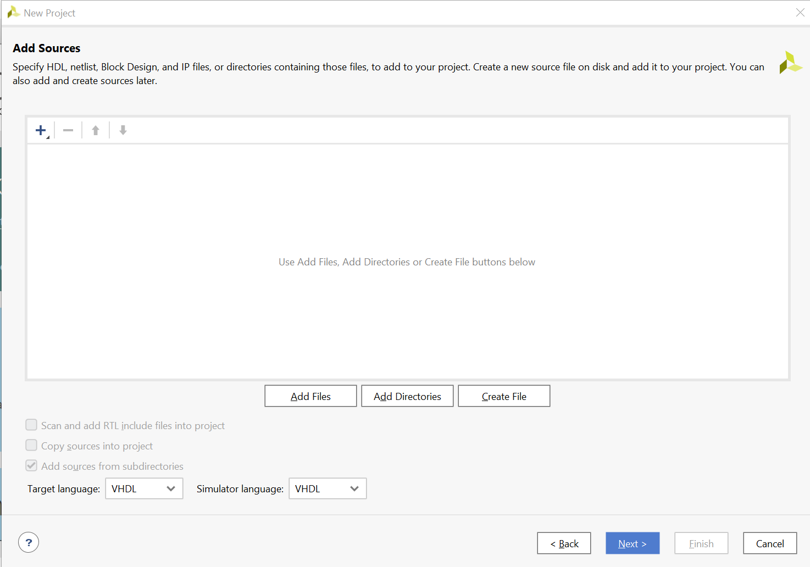
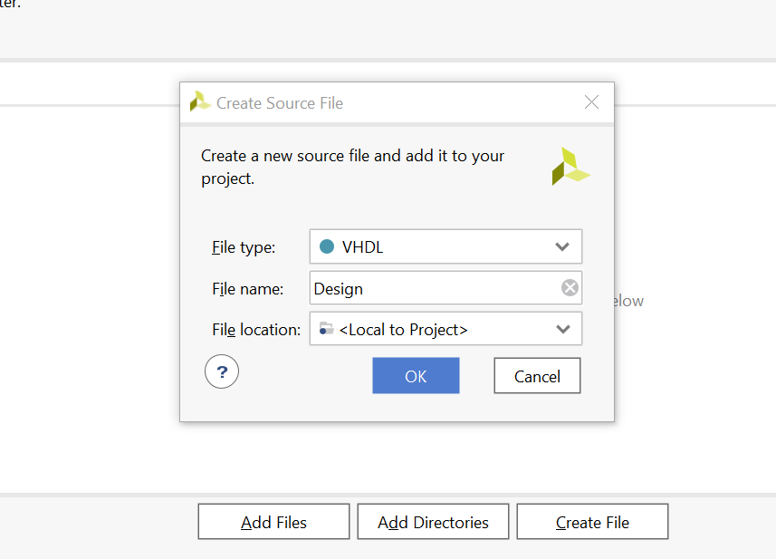
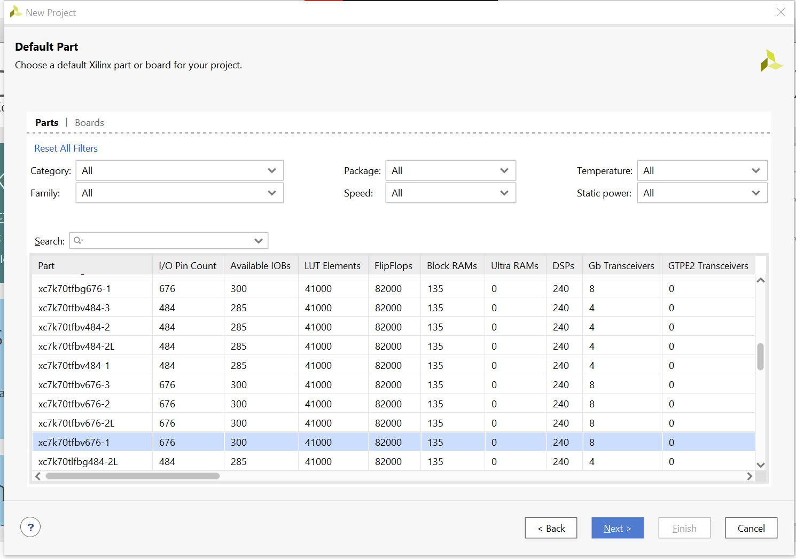
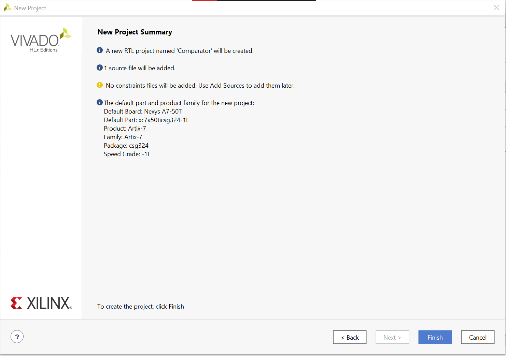
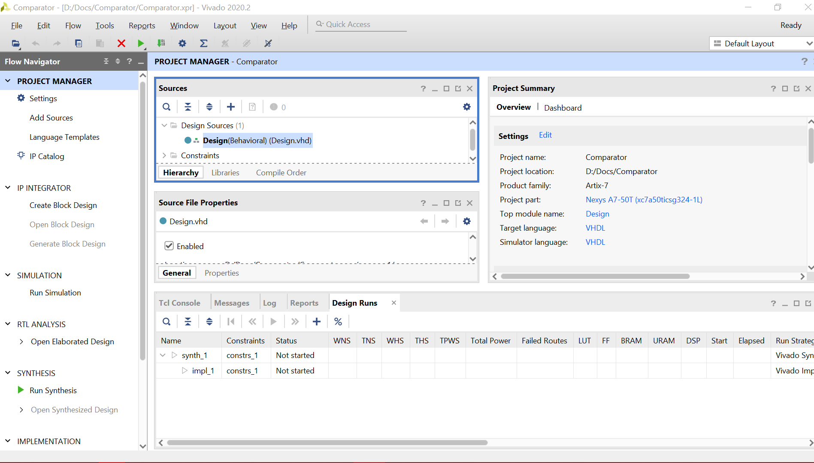
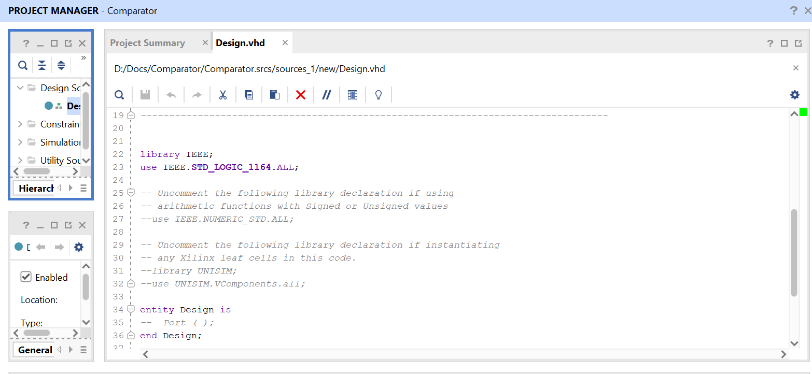
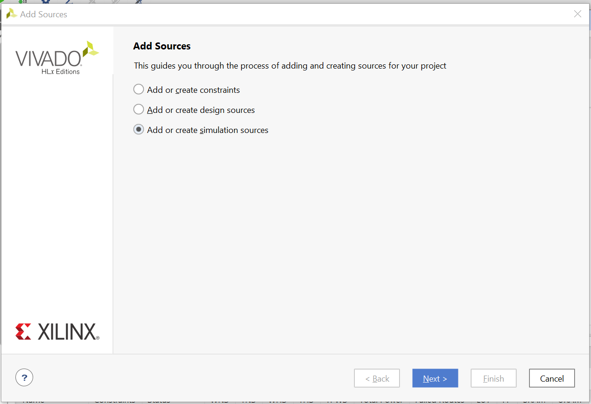

# 3 Vivado

## Lab assignment

1. Preparation tasks (done before the lab at home). Submit:
    * -[ ] Figure or table with connection of 16 slide switches and 16 LEDs on Nexys A7 board.

2. Two-bit wide 4-to-1 multiplexer. Submit:
    * -[x] Listing of VHDL architecture from source file `mux_2bit_4to1.vhd` with syntax highlighting,
    * -[x] Listing of VHDL stimulus process from testbench file `tb_mux_2bit_4to1.vhd` with syntax highlighting,
    * -[x] Screenshot with simulated time waveforms; always display all inputs and outputs.

3. A Vivado tutorial. Submit:
    * -[x] Your tutorial for Vivado design flow: project creation, adding source file, adding testbench file, running simulation, (adding XDC constraints file).

## 1. Table with connection of 16 slide switches and 16 LEDs on Nexys A7 board


## 2. Two-bit wide 4-to-1 multiplexer
Architecture from `mux_2bit_4to1.vhd`
```vhdl
architecture Behavioral of mux_2bit_4to1 is
begin

       f_o <= a_i when (sel_i = "00") else
              b_i when (sel_i = "01") else
              c_i when (sel_i = "10") else
              d_i;
                  
end architecture Behavioral;
```
Stimulus process from `tb_mux_2bit_4to1.vhd`
```vhdl
p_stimulus : process
    begin
        
        s_d <= "00"; s_c <= "00"; s_b <= "00"; s_a <= "00";
        s_sel <= "00"; wait for 50 ns;
        
        s_d <= "00"; s_c <= "00"; s_b <= "00"; s_a <= "01";
        s_sel <= "00"; wait for 50 ns;
        
        s_d <= "00"; s_c <= "00"; s_b <= "01"; s_a <= "00";
        s_sel <= "00"; wait for 50 ns;
        
        s_d <= "00"; s_c <= "00"; s_b <= "01"; s_a <= "01";
        s_sel <= "00"; wait for 50 ns;
        
        s_d <= "00"; s_c <= "00"; s_b <= "00"; s_a <= "00";
        s_sel <= "00"; wait for 50 ns;
        
        s_d <= "00"; s_c <= "11"; s_b <= "00"; s_a <= "00";
        s_sel <= "00"; wait for 50 ns;
        
        
        report "Stimulus process finished" severity note;

    wait;
    end process p_stimulus;
```

Simulated time waveforms:


## 3. A Vivado tutorial
If you want to create vhdl code in Vivado here is a short tutorial on how to begin.


When you open Vivado 2020.2 you should see this window:


* Click on `Create project`.


### 
* Click `Next` to chose Project name and Location.
* Project name is in our case `Comparator` and location is a place on our hard drive where all the files are gonna be stored in one file folder. This folder is gonna be created by the program and named with the Project name.

### 
* Click `Next` until you see the page for adding sources.
* Don't worry though. You can alwas click `Back` and change everything you need.


### 
* `Create File` to create an equivalent to `design.vhd` in EDA Playground. 

### 
Click `Next` and you can add constraints. You can skip this step for you can add them later while working on the project. But the proces is same as before.

Next step is important for connection of our project to a particular board from xilinx we want to use.

### 

* Click on `Boards` and choose which one you are gonna be using. In our case we will use Nexus A7-50T

### 

* Click `Next` and you will see a summary. If there is some problem or you made a mistake feel free to go back and change everything we did so far.

### 

* Click `Finish` and the project will be made.

### 

* In sources you can open your `.vhd` file and write your code. 

### 
* For creating a "testbench" file chose `File/Add Sources` or a shortcut `Alt + A`
* There you can create simulation sources (process is the same as when creating the `Design.vhd` earlier)

### 

* Last thing you might be interested in is runnig the simulation. 
* That is done via `Flow/Run Simulation/Run Behavioral Simulation`


