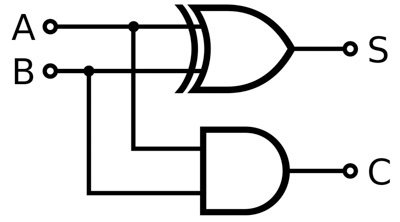

## 1 Preparation tasks (done before the lab at home)

1. A half adder has two inputs A and B and two outputs Carry and Sum. Complete the half adder truth table. Draw a logic diagram of both output functions.

    | **B** | **A** | **Carry** | **Sum** |
    | :-: | :-: | :-: | :-: |
    | 0 | 0 | 0 | 0 |
    | 0 | 1 | 0 | 1 |
    | 1 | 0 | 0 | 1 |
    | 1 | 1 | 1 | 0 |

2. A full adder has three inputs and two outputs. The two inputs are A, B, and Carry input. The outputs are Carry output and Sum. Complete the full adder truth table and draw a logic diagram of both output functions.

    | **Cin** | **B** | **A** | **Cout** | **Sum** |
    | :-: | :-: | :-: | :-: | :-: |
    | 0 | 0 | 0 | 0 | 0 |
    | 0 | 0 | 1 | 0 | 1 |
    | 0 | 1 | 0 | 0 | 1 |
    | 0 | 1 | 1 | 1 | 0 |
    | 1 | 0 | 0 | 0 | 1 |
    | 1 | 0 | 1 | 1 | 0 |
    | 1 | 1 | 0 | 1 | 0 |
    | 1 | 1 | 1 | 1 | 1 |

3. Find the relationship between half adder and full adder logic diagrams.

Full adder is basically combination of two half adders. The difference is it has 3 input values. 

Half Adder                 |  Full Adder
:-------------------------:|:-------------------------:
  |  

4. See schematic of the CPLD expansion board and find out the connection of LEDs, push buttons, and slide switches.

| **Hex** | **Input** | **A** | **B** | **C** | **D** | **E** | **F** | **G** |
| :-: | :-: | :-: | :-: | :-: | :-: | :-: | :-: | :-: |
| 0 | 0000 | 0 | 0 | 0 | 0 | 0 | 0 | 1 |
| 1 | 0001 | 1 | 0 | 0 | 1 | 1 | 1 | 1 |
| 2 | 0010 | 0 | 0 | 1 | 0 | 0 | 1 | 0 |
| 3 | 0011 | 0 | 0 | 0 | 0 | 1 | 1 | 0 |
| 4 | 0100 | 1 | 0 | 0 | 1 | 1 | 0 | 0 |
| 5 | 0101 | 0 | 1 | 0 | 0 | 1 | 0 | 0 |
| 6 | 0110 | 0 | 1 | 0 | 0 | 0 | 0 | 0 |
| 7 | 0111 | 0 | 0 | 0 | 1 | 1 | 1 | 1 |
| 8 | 1000 | 0 | 0 | 0 | 0 | 0 | 0 | 0 |
| 9 | 1001 | 0 | 0 | 0 | 0 | 1 | 0 | 0 |
| A | 1010 | 0 | 0 | 0 | 1 | 0 | 0 | 0 |
| b | 1011 | 1 | 1 | 0 | 0 | 0 | 0 | 0 |
| C | 1100 | 0 | 1 | 1 | 0 | 0 | 0 | 1 |
| d | 1101 | 1 | 0 | 0 | 0 | 0 | 1 | 0 |
| E | 1110 | 0 | 1 | 1 | 0 | 0 | 0 | 0 |
| F | 1111 | 0 | 1 | 1 | 1 | 0 | 0 | 0 |
