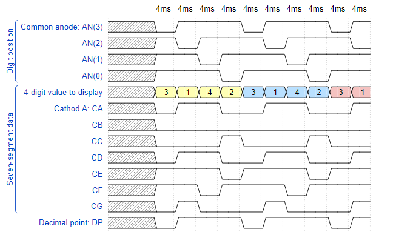

# 6. Driver for multiple seven-segment displays

## Lab assignment

1. Preparation tasks (done before the lab at home). Submit:
    * -[x] Timing diagram figure for displaying value `3.142`.

2. Display driver. Submit:
    * -[ ] Listing of VHDL code of the process `p_mux` with syntax highlighting.
    * -[ ] Listing of VHDL testbench file `tb_driver_7seg_4digits` with syntax highlighting and asserts,
    * -[ ] Screenshot with simulated time waveforms; always display all inputs and outputs,
    * -[ ] Listing of VHDL architecture of the top layer.

3. Eight-digit driver. Submit:
    * -[ ] Image of the driver schematic. The image can be drawn on a computer or by hand.
    
    
## 1. Preparation tasks

Timing diagram figure for displaying value '3.142'



```
{
  signal:
  [
    ['Digit position',
      {name: 'Common anode: AN(3)', wave: 'xx01..01..01'},
      {name: 'AN(2)', wave: 'xx101..01..0'},
      {name: 'AN(1)', wave: 'xx1.01..01..'},
      {name: 'AN(0)', wave: 'xx1..01..01.'},
    ],
    ['Seven-segment data',
      {name: '4-digit value to display', wave: 'xx3333555599', data: ['3','1','4','2','3','1','4','2','3','1']},
      {name: 'Cathod A: CA', wave: 'xx01.0.1.0.1'},
      {name: 'CB', wave: 'xx0.........'},
      {name: 'CC', wave: 'xx0..10..10.'},
      {name: 'CD', wave: 'xx01.0.1.0.1'},
      {name: 'CE', wave: 'xx1..01..01.'},
      {name: 'CF', wave: 'xx1.01..01..'},
      {name: 'CG', wave: 'xx010..10..1'},
    ],
    {name: 'Decimal point: DP', wave: 'xx01..01..01'},
  ],
  head:
  {
    text: '                    4ms   4ms   4ms   4ms   4ms   4ms   4ms   4ms   4ms   4ms',
  },
}

```
