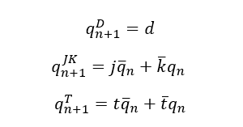
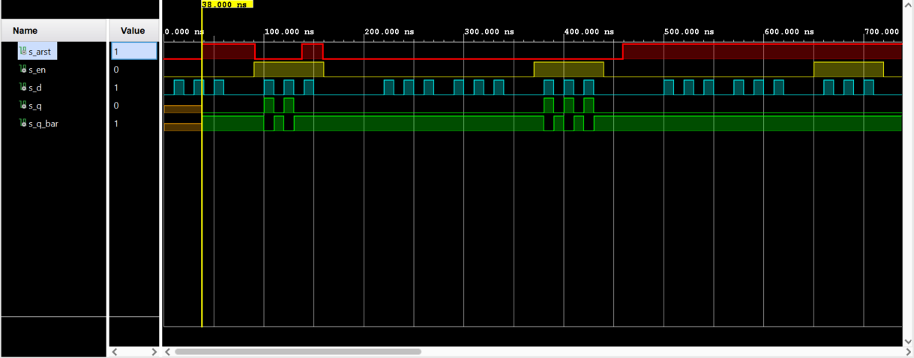
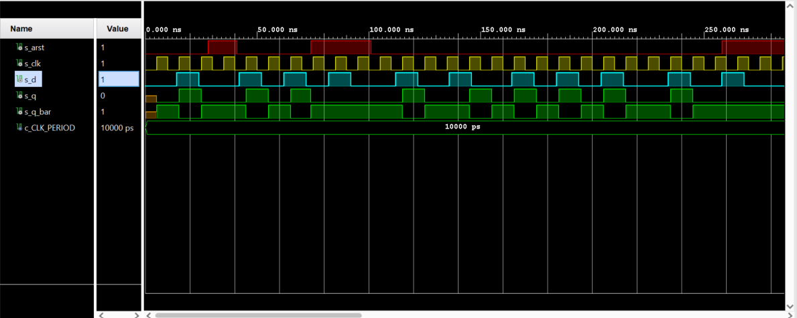
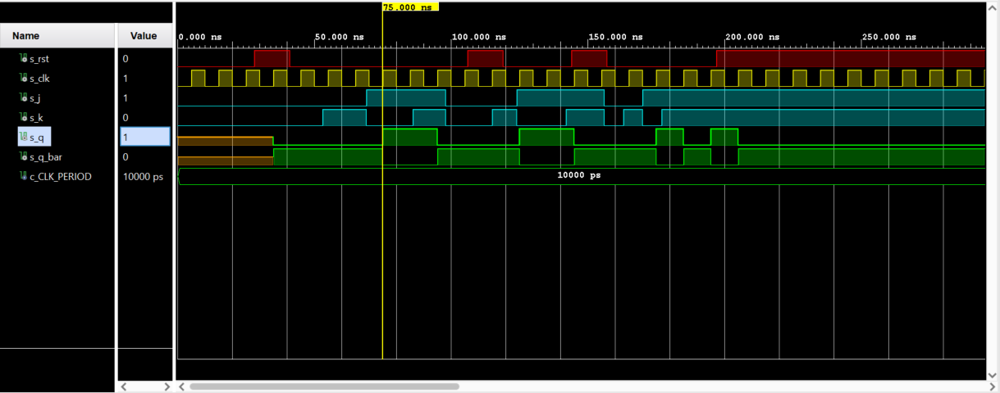

# 7 Latches and Flip-flops

## Lab assignment

1. Preparation tasks (done before the lab at home). Submit:
    * -[x] Characteristic equations and completed tables for D, JK, T flip-flops.

2. D latch. Submit:
    * -[x] VHDL code listing of the process `p_d_latch` with syntax highlighting,
    * -[x] Listing of VHDL reset and stimulus processes from the testbench `tb_d_latch` file with syntax highlighting and asserts,
    * -[x] Screenshot with simulated time waveforms; always display all inputs and outputs. The full functionality of the entity must be verified.

3. Flip-flops. Submit:
    * -[ ] VHDL code listing of the processes `p_d_ff_arst`, `p_d_ff_rst`, `p_jk_ff_rst`, `p_t_ff_rst` with syntax highlighting,
    * -[ ] Listing of VHDL clock, reset and stimulus processes from the testbench files with syntax highlighting and asserts,
    * -[ ] Screenshot, with simulated time waveforms; always display all inputs and outputs. The full functionality of the entities must be verified.

4. Shift register. Submit:
    * -[ ] Image of the shift register schematic. The image can be drawn on a computer or by hand. Name all inputs, outputs, components and internal signals.
    
## 1. Preparation tasks

Characteristic equations and completed tables for D, JK, T flip-flops
`Qn` represents main output value before clock edge and `Q(n+1)` represents value after the edge.



  | **D** | **Qn** | **Q(n+1)** | **Comments** |
   | :-: | :-: | :-: | :-- |
   | 0 | 0 | 0 | no change |
   | 0 | 1 | 0 | change |
   | 1 | 0 | 1 | no change |
   | 1 | 1 | 1 | change |

   | **J** | **K** | **Qn** | **Q(n+1)** | **Comments** |
   | :-: | :-: | :-: | :-: | :-- |
   | 0 | 0 | 0 | 0 | No change |
   | 0 | 0 | 1 | 1 | No change |
   | 0 | 1 | 0 | 0 | reset |
   | 0 | 1 | 1 | 0 | reset |
   | 1 | 0 | 0 | 1 | set |
   | 1 | 0 | 1 | 1 | set |
   | 1 | 1 | 0 | 1 | toggle |
   | 1 | 1 | 1 | 0 | toggle |

   | **T** | **Qn** | **Q(n+1)** | **Comments** |
   | :-: | :-: | :-: | :-- |
   | 0 | 0 | 0 | no change |
   | 0 | 1 | 1 | no change |
   | 1 | 0 | 1 | invert |
   | 1 | 1 | 0 | invert |
      
 ## 2. D latch
   
 VHDL code listing of the process `p_d_latch`
 
```vhdl
 architecture Behavioral of d_latch is                                                    
                                                                                         
begin                                                                                    
                                                                                         
    ------------------------------------------------------------------------                 
    -- p_alarm:                                                                              
    -- A combinational process of alarm clock.                                               
    ------------------------------------------------------------------------                 
    p_d_latch : process (d, arst, en)                                                        
    begin                                                                                    
        if     (arst = '1')   then                                                                 
            q     <= '0';                                                                    
            q_bar <= '1';                                                                    
        elsif  (en = '1')     then                                                               
            q     <= d;                                                                          
            q_bar <= not d;                                                                  
        end if;                                                                              
    end process p_d_latch;                                                                   
                                                                                             
end Behavioral;                    
```

Listing of VHDL reset and stimulus processes from the testbench `tb_d_latch` file with syntax highlighting and asserts
 
```vhdl
     p_stimulus  : process
     begin
        report "Stimulus process started" severity note;
        
        s_en <= '0';
        s_d  <= '0';
        
        assert(s_q='0' and s_q_bar = '1')
        report "huh" severity error;
        
        --d sekvence
        wait for 10 ns;
        s_d <= '1';
        wait for 10 ns;
        s_d <= '0';
        wait for 10 ns;
        s_d <= '1';
        wait for 10 ns;
        s_d <= '0';
        wait for 10 ns;
        s_d <= '1';
        wait for 10 ns;
        s_d <= '0';
        wait for 10 ns;
        s_d <= '0';
        wait for 10 ns;
        s_d <= '0';
        wait for 10 ns;
        s_d <= '0';
     
        assert(s_q='0' and s_q_bar = '1')
        report "huh" severity error;    
        
        --/d select
        s_en <= '1';
        wait for 10 ns;
       
        --d sekvence
        s_d <= '1';
        wait for 10 ns;
        s_d <= '0';
        wait for 10 ns;
        s_d <= '1';
        wait for 10 ns;
        s_d <= '0';
        wait for 10 ns;
        s_d <= '1';
        wait for 10 ns;
        s_d <= '0';
        wait for 10 ns;
        s_d <= '0';
            
        assert(s_q='0' and s_q_bar = '1')
        report "huh" severity error;    
        
        --/d select
        s_en <= '0';
        wait for 50 ns;
        
        --d sekvence
        wait for 10 ns;
        s_d <= '1';
        wait for 10 ns;
        s_d <= '0';
        wait for 10 ns;
        s_d <= '1';
        wait for 10 ns;
        s_d <= '0';
        wait for 10 ns;
        s_d <= '1';
        wait for 10 ns;
        s_d <= '0';
        wait for 10 ns;
        s_d <= '0';
            
     report "Stimulus process finished" severity note;
     end process p_stimulus;
```

Screenshot with simulated time waveforms



## 3. Flip-flops
VHDL code listing of the process `p_d_ff_arst`
```vhdl
architecture Behavioral of d_ff_arst is

begin

p_d_ff_arst : process (clk, arst)             
begin                                         
        if (arst = '1') then                      
            q     <= '0';                         
            q_bar <= '1';
                                
        elsif  rising_edge(clk) then                    
            q <= d;                               
            q_bar <= not d;                       
        end if;                                   
end process p_d_ff_arst;                        

end Behavioral;
```
Listing of VHDL clock, reset and stimulus processes from the testbench files with syntax highlighting and asserts
```vhdl
    p_stimulus  : process
 begin
    report "Stimulus process started" severity note;
    s_d  <= '0';
    
    --d sekvence
    wait for 14 ns;
    s_d <= '1';
    wait for 10 ns;
    s_d <= '0';
    wait for 8 ns;
    
    assert(s_q='0' and s_q_bar = '1')
    report "huh" severity error;
    
    --d sekvence
    wait for 10 ns;
    s_d <= '1';
    wait for 10 ns;
    s_d <= '0';
    wait for 10 ns;
    s_d <= '1';
    wait for 10 ns;
    s_d <= '0';
    wait for 10 ns;
    s_d <= '1';
    wait for 10 ns;
    s_d <= '0';
    wait for 10 ns;
    s_d <= '0';
    wait for 10 ns;
    s_d <= '1';
    wait for 10 ns;
    s_d <= '0';
    
 report "Stimulus process finished" severity note;
 end process p_stimulus;
```

Screenshot with simulated time waveforms



VHDL code listing of the process `p_d_ff_rst`
```vhdl
architecture Behavioral of d_ff_rst is

begin
    p_d_ff_rst : process (clk)
    begin
        if rising_edge(clk) then
            if (rst = '1') then
                q       <= '0';
                q_bar   <= '1';
            else
                q       <= d;
                q_bar   <= not d;
            end if;
        end if;
    end process p_d_ff_rst;
end Behavioral;

```
Listing of VHDL clock, reset and stimulus processes from the testbench files with syntax highlighting and asserts
```vhdl
--------------------------------------------------------------------
        -- Data generation process
        --------------------------------------------------------------------
        p_stimulus : process
        begin
            report "Stimulus process started" severity note;
                                                 
                --d sekvence
                s_d <= '1';
                wait for 10 ns;
                s_d <= '0';
                wait for 10 ns;  
                s_d <= '1';
                wait for 10 ns;  
                s_d <= '0';
                wait for 10 ns;  
                
                assert (s_q = '0' and s_q_bar = '1')
                report "process failed" severity error;
                
                wait for 10 ns;
                s_d <= '1'; wait for 20 ns;
                
                assert (s_q = '1' and s_q_bar = '0')
                report "process failed" severity error;
                
                wait for 10 ns;
                s_d <= '0';
                wait for 10 ns;
                s_d <= '1';
                wait for 10 ns;  
                s_d <= '0';
                wait for 10 ns;  
                s_d <= '1';
                wait for 10 ns;  
                s_d <= '0';
                wait for 10 ns;  
                s_d <= '1';
                wait for 10 ns;    
                s_d <= '0';
                wait for 10 ns;  
                s_d <= '1';
                wait for 10 ns;  
                s_d <= '0';
                wait for 10 ns;  
                s_d <= '1';
                wait for 10 ns;     
            
            report "Stimulus process finished" severity note;
            wait;
            end process p_stimulus;  
```

Screenshot with simulated time waveforms


VHDL code listing of the process `p_jk_ff_rst`
```vhdl
architecture Behavioral of jk_ff_rst is

    signal s_q : std_logic;
    
begin

p_jk_ff_rst : process (clk)             
begin                                         
  if rising_edge(clk) then 
      if (rst = '1') then
          s_q <= '0';
      else
             if (j = '0' and k = '0') then  --No change
              s_q <= s_q;
             elsif (j = '0' and k = '1') then  --Reset
                 s_q <= '0';
             elsif (j = '1' and k = '0') then  --Set
                 s_q <= '1';
             elsif (j = '1' and k = '1') then  --Toggle                
             s_q <= not s_q;  
             end if; 
      end if;                   
  end if;                                   
end process p_jk_ff_rst;       

  q <= s_q;
  q_bar <= not s_q;

end Behavioral;
```
Listing of VHDL clock, reset and stimulus processes from the testbench files with syntax highlighting and asserts
```vhdl
    --------------------------------------------------------------------
    -- Clock generation process
    --------------------------------------------------------------------
    p_clk_gen : process
    begin
        while now < 750 ns loop         -- 75 periods of 100MHz clock
            s_clk <= '0';
            wait for c_CLK_PERIOD / 2;
            s_clk <= '1';
            wait for c_CLK_PERIOD / 2;
        end loop;
        wait;
    end process p_clk_gen;
    
    p_reset_gen : process
    begin
        s_rst <= '0';
        wait for 28 ns;
        
        -- Reset activated
        s_rst <= '1';
        wait for 13 ns;
        -- Reset deactivated
        s_rst <= '0';
        wait for 65 ns;
        s_rst <= '1';
        wait for 13 ns;
        -- Reset deactivated
        s_rst <= '0';
        wait for 25 ns;
        s_rst <= '1';
        wait for 13 ns;
        -- Reset deactivated
        s_rst <= '0';
        wait for 40 ns;
        s_rst <= '1';
        wait;
    end process p_reset_gen;
    
    p_stimulus : process
    begin
        report "Stimulus process started" severity note;
            s_j  <= '0';
            s_k  <= '0';
    
            assert(s_q='0' and s_q_bar = '1')
            report "huh" severity error;
            
            --d sekvence
            wait for 40 ns;
            s_j <= '0';
            s_k <= '0';
            wait for 13 ns;
            s_j <= '0';
            s_k <= '1';
            wait for 16 ns;
            s_j <= '1';
            s_k <= '0';
            wait for 17 ns;
            s_j <= '1';
            s_k <= '1';
        
            wait for 12 ns;
            s_j <= '0';
            s_k <= '0';
            wait for 17 ns;
            s_j <= '0';
            s_k <= '1';
            wait for 9 ns;
            s_j <= '1';
            s_k <= '0';
            wait for 18 ns;
            s_j <= '1';
            s_k <= '1';
            wait for 14 ns;
            s_j <= '0';
            s_k <= '0';
            wait for 7 ns;
            s_j <= '0';
            s_k <= '1';
            wait for 7 ns;
            s_j <= '1';
            s_k <= '0';
            wait for 7 ns;
            s_j <= '1';
            s_k <= '1';
            
        report "Stimulus process finished" severity note;
        wait;
    end process p_stimulus;
```

Screenshot with simulated time waveforms



VHDL code listing of the process `p_t_ff_rst`
```vhdl

```
Listing of VHDL clock, reset and stimulus processes from the testbench files with syntax highlighting and asserts
```vhdl

```

Screenshot with simulated time waveforms


## Shift register

Image of the shift register schematic. The image can be drawn on a computer or by hand. Name all inputs, outputs, components and internal signals.

